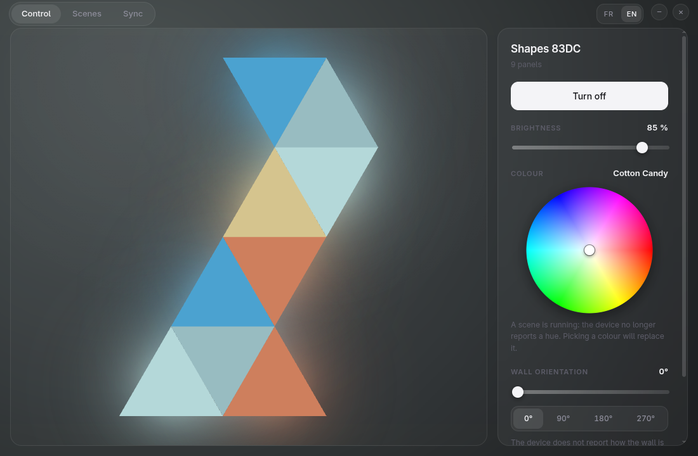
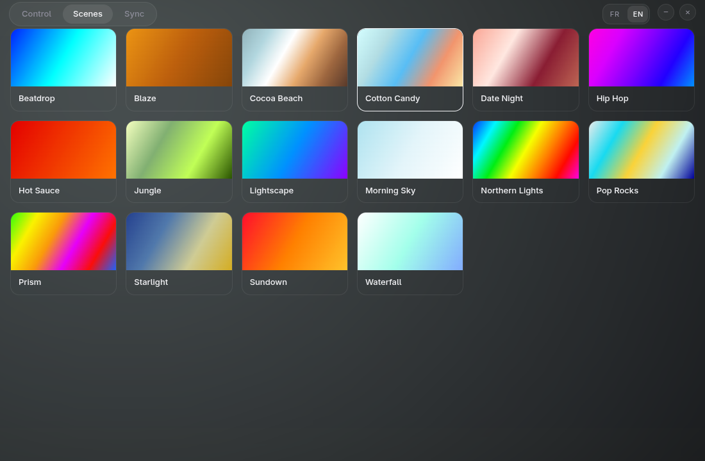
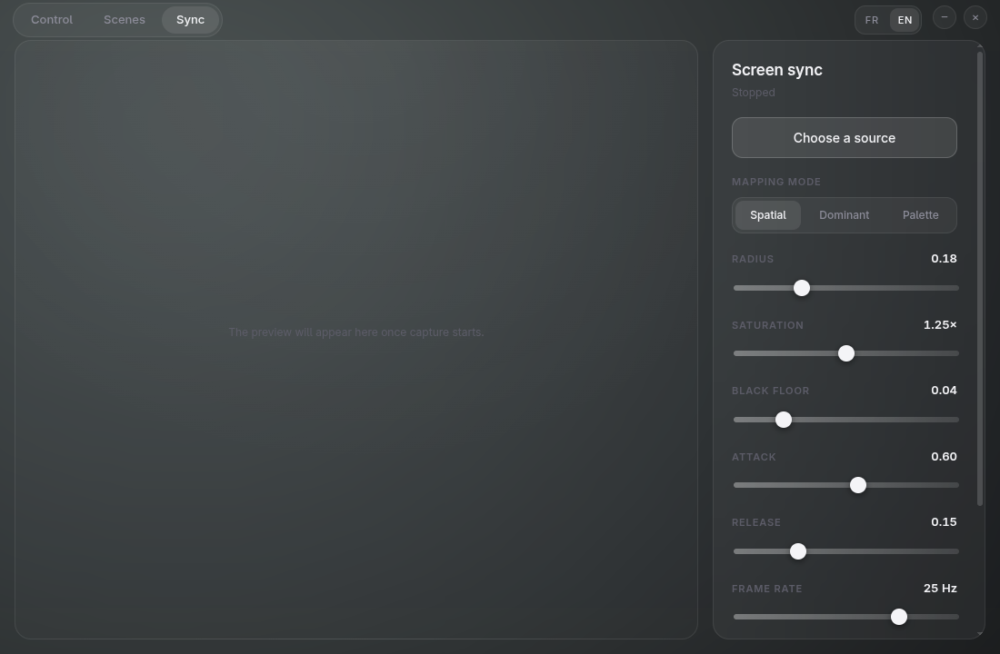

<div align="center">


**Pilote tes panneaux Nanoleaf depuis Linux — et laisse ton écran déborder sur le mur.**

[](https://github.com/myqzurdux3/eclat/actions/workflows/ci.yml)
[](LICENSE)


[English](README.md) · [Démarrer](#démarrer) · [Architecture](#architecture) · [Ce que le matériel apprend](#ce-que-le-matériel-apprend)

</div>

---



## Ce que c'est

Éclat parle aux panneaux Nanoleaf directement par leur API HTTP locale — sans
compte cloud, sans SDK propriétaire, sans télémétrie. Il les découvre en mDNS,
s'appaire avec eux, dessine ton mur en WebGL2 à sa géométrie réelle, et pilote
chaque panneau en temps réel depuis ce qui s'affiche à l'écran.

> **État : fonctionnel, pas terminé.** Découverte, appairage, contrôle, scènes
> et synchronisation écran tournent contre le vrai matériel. La synchronisation
> audio et l'empaquetage restent à écrire. Voir la [feuille de route](#feuille-de-route).

## Pourquoi

L'application mobile de Nanoleaf est le seul moyen officiellement pris en
charge de piloter ces panneaux, et les outils tiers pour bureau que j'ai
essayés ne fonctionnaient pas sur un poste Wayland/GNOME à jour. Tout ce qui
suit parle aux panneaux directement, par leur API HTTP locale documentée —
sans compte cloud, sans SDK propriétaire, sans télémétrie.

<table>
<tr>
<td width="50%"></td>
<td width="50%"></td>
</tr>
<tr>
<td align="center"><em>Les scènes, aux couleurs des palettes du device</em></td>
<td align="center"><em>La synchronisation écran, pipeline à découvert</em></td>
</tr>
</table>

## Ce que ça fait

- **Découverte** en mDNS (`_nanoleafapi._tcp`), écrite directement sur
  `node:dgram` — voir [le mDNS sous Linux](#ce-que-le-matériel-apprend).
- **Appairage** par l'API locale du panneau ; le token est rangé dans
  `~/.config/eclat/config.json` en `0600` et ne quitte jamais le
  processus main d'Electron.
- **Rendu du mur** en WebGL2 sans bibliothèque de rendu : chaque panneau est
  dessiné à sa position, sa forme et sa rotation réelles, halo compris.
- **Contrôle** : allumage, luminosité, roue teinte/saturation, et peinture d'un
  panneau au clic.
- **Scènes** bâties sur les palettes réellement stockées dans le device, pas
  sur des couleurs inventées.
- **Synchronisation écran** : capture par le portail Wayland, analyse dans un
  Worker dédié, trois modes de mapping (spatial, dominante, palette), détection
  de letterbox, moyenne en lumière linéaire et lissage temporel asymétrique.
- **Plusieurs murs** : appaire autant de devices que tu veux, bascule de l'un
  à l'autre, et alimente-les tous depuis une seule capture.
- **Un mur vivant** : la maquette suit le device — exacte quand Éclat pilote
  les panneaux, animée d'après la palette de la scène sinon.
- **Synchronisation audio** : Éclat écoute le monitor PipeWire de tes
  enceintes ; les bandes pilotent la teinte, les battements éclairent le mur.
- Interface **française et anglaise**.

## Prérequis

- Linux avec Node.js 22+ (développé sous Node 26, Ubuntu 26.04, Wayland/GNOME).
- Un device Nanoleaf sur le même réseau. Développé et vérifié contre des
  **Nanoleaf Shapes (NL42)**, firmware 12.x. Les Canvas, Elements et Lines
  partagent la même API et figurent dans la table des formes, mais ne sont pas
  testés.
- Les panneaux sont **2,4 GHz uniquement** — vérifie que ton point d'accès
  diffuse bien un SSID en 2,4 GHz.

## Démarrer

```bash
git clone https://github.com/myqzurdux3/eclat.git
cd eclat
npm install
npm start
```

Pour produire une AppImage et un `.deb` :

```bash
npm run package     # écrit dans release/
```

La synchronisation audio lit le monitor des enceintes via `pw-record` et
`pw-dump`, fournis par `pipewire-bin`. Le `.deb` recommande le paquet ;
l'AppImage l'attend sur le système.

Au premier lancement l'application cherche les panneaux sur le réseau local.
Maintiens le bouton power du panneau 5 à 7 secondes, jusqu'au clignotement de
la LED, puis clique sur **Appairer**.

### Bac à sable d'Electron sous Ubuntu

Ubuntu restreint les espaces de noms utilisateur non privilégiés, donc Chromium
se rabat sur son helper SUID, que npm n'installe pas en root. Si Electron
s'arrête sur *« The SUID sandbox helper binary was found, but is not configured
correctly »*, lance une fois par `npm install` :

```bash
sudo chown root:root node_modules/electron/dist/chrome-sandbox
sudo chmod 4755 node_modules/electron/dist/chrome-sandbox
```

Ne passe pas `--no-sandbox` à la place : ça désactive définitivement
l'isolation du renderer pour contourner un réglage système temporaire.

## Développement

```bash
npm test                # 409 tests unitaires, sans matériel ni réseau
npm run typecheck       # processus main + renderer
npm run build           # processus main + renderer
npm run dev:renderer    # serveur Vite, puis :
VITE_DEV_SERVER_URL=http://localhost:5173 npm start
```

Ouvrir `http://localhost:5173` directement dans un navigateur affiche un
avertissement plutôt que l'application : le serveur Vite ne sert que
l'interface, et tout ce qui parle aux panneaux vit dans le processus main.

### Parti pris sur les tests

Aucun test n'a besoin de matériel, de réseau, de GPU ni de DOM. Le device est
doublé par `FakeNanoleaf` (REST) et `FakeStreamReceiver` (UDP), si bien que le
chemin complet de l'appairage au streaming est couvert en CI. Tout ce qui peut
être une fonction pure — conversion colorimétrique, géométrie des panneaux,
pipeline de synchronisation entier — en est une, et se teste sur des images
fabriquées à la main.

Deux outils couvrent ce que les tests unitaires ne peuvent pas :

```bash
npm run build
CAPTURE_OUT=/tmp/ui.png npx electron tools/capture-ui.cjs   # photographie la fenêtre
npx electron tools/probe-worker-transfer.cjs                # capture → Worker → couleurs
```

## Architecture

```
main (Node)                          renderer (React)
├── device/discovery.ts  mDNS        ├── screens/     Contrôle, Scènes, Sync
├── device/pairing.ts    POST /new   ├── gl/          mur WebGL2
├── device/client.ts     REST :16021 └── worker/      analyse des frames
├── device/stream.ts     UDP :60222        │
├── device/arbiter.ts    priorités         ▼
└── store.ts             config 0600   shared/  fonctions pures, sans E/S
```

Trois règles tiennent l'ensemble :

1. **Le renderer n'ouvre aucune socket.** Il produit des couleurs et les passe
   par IPC. Le token ne l'atteint jamais.
2. **`stream.ts` est le seul writer de la socket UDP.** Toute source passe par
   `arbiter.ts`, qui impose une priorité stricte : peinture manuelle devant la
   synchronisation écran, devant l'audio, devant l'effet propre du device. Un
   trait prend le pas sur une synchro en cours pendant trois secondes ; seule,
   la peinture tient le mur jusqu'à ce qu'une scène, une synchro, l'extinction
   ou le device lui-même le reprenne.
3. **Le traitement pixel vit dans un Worker.** Le thread UI ne touche jamais
   une frame.

## Ce que le matériel apprend

Des choses que la documentation ne dit pas, trouvées à la mesure :

- **Le mDNS sous Linux.** `bonjour-service` ne trouve rien sur un poste
  ordinaire : `avahi-daemon` occupe déjà le port 5353 et le noyau ne délivre la
  réponse multicast qu'à un seul des processus liés. Les requêtes d'ici arment
  donc le bit QU pour obtenir une réponse unicast sur un port éphémère. Une
  socket est ouverte par interface IPv4, un VPN actif portant la route par
  défaut sans mener au réseau local.
- **La latence REST va de 60 à 340 ms.** Un curseur émet une soixantaine
  d'événements par seconde : les écritures doivent être fusionnées — une
  requête en vol, la dernière valeur gagne. Mesuré : 60 valeurs → 3 requêtes.
- **Le mode externe est révocable.** Toute autre commande — l'app mobile, le
  bouton physique — le reprend, donc un sync actif le réarme toutes les 10 s.
  Revers de la médaille : un stream jamais relâché rend le device incapable
  d'afficher le moindre effet.
- **`normalizeLayout` normalise les centres** des panneaux, dont les polygones
  débordent du carré unité de tout un rayon circonscrit — 20 % sur un vrai mur
  Shapes. Le cadrage doit partir des sommets réels.
- **Les couleurs des panneaux ne se lisent pas.** Le device n'expose aucune
  couleur panneau par panneau, et les animations de ses effets sont des
  greffons fermés. Quand une scène du device tourne, le mur affiché est donc
  animé *d'après la palette de la scène* — un mouvement plausible, pas un
  reflet, et l'interface le dit. Quand c'est Éclat qui pilote, l'affichage est
  exact.
- **En revanche le device signale ce qui change.** Un flux Server-Sent Events
  sur `/events` annonce l'allumage, la luminosité, la couleur et l'effet — y
  compris quand la commande vient de l'app mobile ou du bouton. Éclat le suit,
  son affichage ne se périme donc jamais.

## Feuille de route

| Jalon | État |
|---|---|
| 1 — Socle device : découverte, appairage, REST, layout | fait |
| 2 — Streaming : extControl v2, encodage, arbitre | fait |
| 3 — UI de contrôle : mur WebGL2, roue chromatique, scènes | fait |
| 4 — Sync écran : capture portail, Worker, pipeline couleur | fait |
| 5 — Sync audio : capture monitor PipeWire, analyse | fait |
| 6 — Empaquetage avec electron-builder | fait |

## Contribuer

Les tickets et les pull requests sont les bienvenus. Le code, ses commentaires
et les tests sont en anglais. Les notes de conception et les plans
d'implémentation sont dans `docs/superpowers/`, en français.

Avant d'ouvrir une pull request :

```bash
npm test
npm run typecheck
npm run build
```

## Licence

MIT — voir [LICENSE](LICENSE).

Éclat n'a aucun lien avec Nanoleaf, et n'est ni approuvé ni soutenu par eux.
« Nanoleaf » est une marque de son propriétaire, employée ici uniquement pour
dire à quoi ce logiciel parle.
