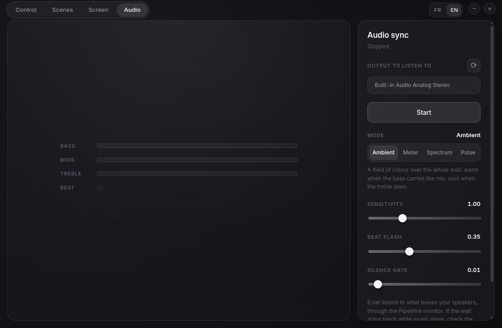

<div align="center">


**Drive your Nanoleaf panels from Linux — and let your screen spill onto the wall.**

[](https://github.com/myqzurdux3/eclat/actions/workflows/ci.yml)
[](LICENSE)


[Français](README.fr.md) · [Getting started](#getting-started) · [How it works](#architecture) · [What the hardware taught us](#notes-from-the-hardware)

</div>

---


## What it is

Éclat talks to Nanoleaf light panels directly over their local HTTP API — no
cloud account, no vendor SDK, no telemetry. It finds them over mDNS, pairs with
them, draws your wall in WebGL2 at its real geometry, and can drive every panel
in real time from whatever is on your screen.

> **Status: working.** Discovery, pairing, control, scenes, screen sync and
> audio sync all run against real hardware, and the app packages to an
> AppImage and a `.deb` — see the [roadmap](#roadmap).

## Why it exists

The Nanoleaf mobile app is the only officially supported way to drive these
panels, and the third-party desktop tools I tried did not work on a current
Wayland/GNOME desktop. So this one is built for that desktop, and every awkward
detail it ran into is written down in [Notes from the hardware](#notes-from-the-hardware).

## Features

|  |  |
|---|---|
| **Discovery** | mDNS (`_nanoleafapi._tcp`), implemented directly on `node:dgram` — [and here is why](#notes-from-the-hardware) |
| **Pairing** | token stored `0600` in `~/.config/eclat/config.json`, never leaving the Electron main process |
| **Wall** | WebGL2 without a rendering library: real position, shape, rotation, and a diffuse halo per panel |
| **Control** | power, brightness, hue/saturation wheel, and click-to-paint on any single panel |
| **Scenes** | built from the palettes actually stored on the device, not from invented colours |
| **Screen sync** | Wayland portal capture, analysed in a Worker; spatial, dominant and palette mapping |
| **Audio sync** | reads the PipeWire monitor of your speakers, in four modes: a colour field, a left-to-right meter with a falling peak, a frequency axis, or a pulse renewed on every beat |
| **Several walls** | pair as many devices as you like, switch between them, and sync them all from one capture |
| **A living wall** | the mock-up follows the device: exact while Éclat drives the panels, animated from the scene's own palette otherwise |
| **Languages** | French and English |

<table>
<tr>
<td width="50%"></td>
<td width="50%"></td>
</tr>
<tr>
<td align="center"><em>Scenes, coloured by the device's own palettes</em></td>
<td align="center"><em>Screen sync, with the pipeline exposed</em></td>
</tr>
<tr>
<td colspan="2"></td>
</tr>
<tr>
<td colspan="2" align="center"><em>Audio sync, in four modes</em></td>
</tr>
</table>

## Requirements

- Linux with Node.js 22+ — developed on Node 26, Ubuntu 26.04, Wayland/GNOME.
- A Nanoleaf device on the same network. Developed and verified against
  **Nanoleaf Shapes (NL42)**, firmware 12.x. Canvas, Elements and Lines share
  the same API and are present in the shape table, but are untested.
- The panels are **2.4 GHz only** — check that your access point broadcasts a
  2.4 GHz SSID.

## Getting started

```bash
git clone https://github.com/myqzurdux3/eclat.git
cd eclat
npm install
npm start
```

To build an AppImage and a `.deb` instead:

```bash
npm run package     # writes to release/
```

Audio sync reads the speaker monitor through `pw-record` and `pw-dump`,
which ship in `pipewire-bin`. The `.deb` recommends the package; the
AppImage expects it on the system.

On first launch Éclat looks for panels on the local network. Hold the panel's
power button for 5–7 seconds until the LED blinks, then press **Pair**.

<details>
<summary><strong>Electron aborts on the SUID sandbox (Ubuntu)</strong></summary>

Ubuntu restricts unprivileged user namespaces, so Chromium falls back to its
SUID sandbox helper — which npm cannot install as root. Run once per
`npm install`:

```bash
sudo chown root:root node_modules/electron/dist/chrome-sandbox
sudo chmod 4755 node_modules/electron/dist/chrome-sandbox
```

Do not pass `--no-sandbox` instead: that permanently disables the renderer's
isolation to work around a temporary system setting.
</details>

## Development

```bash
npm test                # 429 unit tests — no hardware, network, GPU or DOM
npm run typecheck       # main process + renderer
npm run build           # main process + renderer
npm run dev:renderer    # Vite dev server, then, in another terminal:
VITE_DEV_SERVER_URL=http://localhost:5173 npm start
```

Opening `http://localhost:5173` in a browser shows a notice rather than the
app: Vite only serves the interface, and everything that talks to the panels
lives in the Electron main process.

### How this is tested

No test needs hardware, a network, a GPU or a DOM. The device is doubled by
`FakeNanoleaf` (REST) and `FakeStreamReceiver` (UDP), so the whole path from
pairing to streaming is covered in CI. Everything that can be a pure function —
colour conversion, panel geometry, the entire sync pipeline — is one, and is
tested against hand-built fixtures.

Three tools cover what unit tests cannot reach:

```bash
npm run build
CAPTURE_OUT=/tmp/ui.png npx electron tools/capture-ui.cjs    # screenshot the window
npx electron tools/probe-worker-transfer.cjs                 # capture → Worker → colours
npx electron tools/render-svg.cjs assets/logo.svg out.png 512
```

The second one deserves a word: the Wayland portal needs a human click, so the
capture path cannot be driven end to end. `canvas.captureStream()` produces a
video track without any permission prompt, which makes everything downstream of
the portal testable without anyone present.

## Architecture

```
main (Node)                          renderer (React)
├── device/discovery.ts  mDNS        ├── screens/     Control, Scenes, Sync
├── device/pairing.ts    POST /new   ├── gl/          WebGL2 wall
├── device/client.ts     REST :16021 └── worker/      frame analysis
├── device/stream.ts     UDP :60222        │
├── device/arbiter.ts    priorities        ▼
└── store.ts             0600 config   shared/  pure functions, no I/O
```

Three rules hold the whole thing together:

1. **The renderer opens no socket.** It produces colours and hands them over
   IPC. The auth token never reaches it.
2. **`stream.ts` is the only writer of the UDP socket.** Every source goes
   through `arbiter.ts`, which enforces a strict priority: manual painting
   over screen sync over audio sync over the device's own effect. A stroke
   outranks a running sync for three seconds; painting on its own holds the
   wall until a scene, a sync, the power or the device itself takes it back.
3. **Pixel work lives in a Worker.** The UI thread never touches a frame.

The screen sync pipeline runs in a fixed order, and the order is not
interchangeable: letterbox detection, averaging in linear light, mapping,
correction, then asymmetric temporal smoothing.

## Notes from the hardware

Things no documentation mentions, found by measuring:

- **mDNS does not just work on Linux.** `bonjour-service` finds nothing on a
  typical desktop: `avahi-daemon` already holds port 5353, and the kernel hands
  the multicast answer to only one of the bound processes. Éclat sets the QU
  bit to get a unicast answer on an ephemeral port instead, and opens one
  socket per IPv4 interface — an active VPN owns the default route without
  reaching the LAN.
- **REST latency is 60–340 ms.** A slider emits around sixty events per second,
  so writes have to be coalesced: one request in flight, latest value wins.
  Measured: 60 slider values became 3 requests, final value exact.
- **External control is revocable, and that cuts both ways.** Any other command
  takes it back, so an active sync re-arms every 10 seconds — but a stream that
  is never released leaves the device unable to display any effect at all,
  silently overwriting every scene you pick.
- **Panel geometry overflows its own normalisation.** The layout API gives
  panel *centres*; the polygons stick out by a full circumradius — 20 % on a
  real Shapes wall. Framing has to be computed from actual vertices.
- **Panel colours cannot be read back.** The device exposes no per-panel
  colour, and its effect animations are closed plugins. So when a device scene
  is running, the wall in Éclat is animated *from the scene's palette* — a
  plausible motion, not a mirror, and the interface says so. While Éclat is
  the one driving the panels, what you see is exact.
- **The device does report what changed**, though. A Server-Sent Events stream
  on `/events` announces power, brightness, colour and effect changes — even
  those made from the mobile app or the physical button. Éclat follows it, so
  its display never goes stale.
- **A `MediaStreamTrack` is not transferable** in this build of Chromium.
  The `MediaStreamTrackProcessor` is built on the main thread and its
  `ReadableStream` is what crosses into the Worker.
- **`enumerateDevices()` exposes no monitor source**, so system audio cannot
  be captured through the browser APIs at all. Éclat reads the sink's monitor
  straight from PipeWire instead. Mind that PipeWire applies the sink volume
  *before* the monitor tap: a muted output records silence.
- **A panel's address is not for keeping.** A renewed DHCP lease moves it,
  and a stored address would strand the pairing; discovery refreshes it.

## Roadmap

| Milestone | State |
|---|---|
| 1 — Device layer: discovery, pairing, REST, layout | ✅ |
| 2 — Streaming: extControl v2, frame encoding, arbiter | ✅ |
| 3 — Control UI: WebGL2 wall, colour wheel, scenes | ✅ |
| 4 — Screen sync: portal capture, Worker, colour pipeline | ✅ |
| 5 — Audio sync: PipeWire monitor capture, analysis | ✅ |
| 6 — Packaging with electron-builder | ✅ |

## Contributing

Issues and pull requests are welcome. The code, its comments and the tests
are in English. Design notes and implementation plans live in
`docs/superpowers/` and are in French — see [docs/README.md](docs/README.md).

Before opening a pull request:

```bash
npm test
npm run typecheck
npm run build
```

## Licence

MIT — see [LICENSE](LICENSE).

Éclat is not affiliated with, endorsed by, or supported by Nanoleaf.
"Nanoleaf" is a trademark of its owner, used here only to say what this
software talks to.
